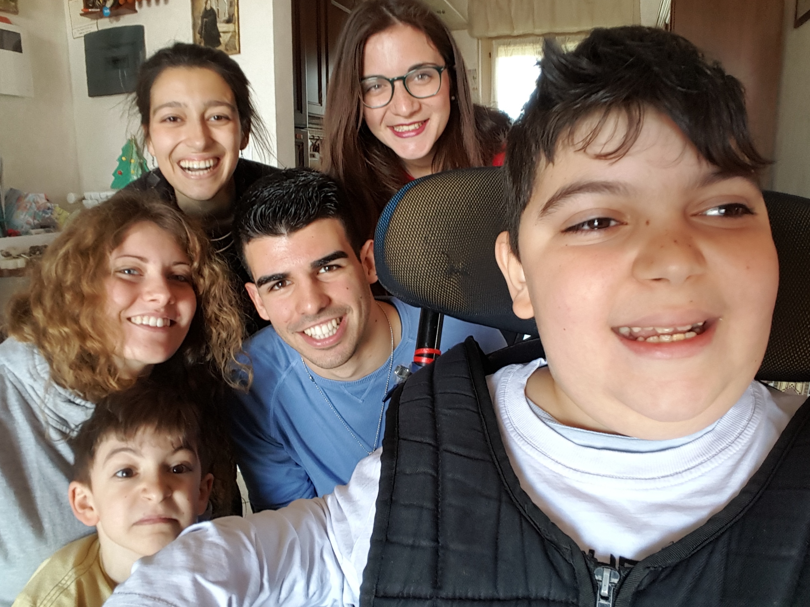

# Il Tavolino di Andrea

Il Tavolino di Andrea è stato progettato pensando alle esigenze di Andrea, bambino malato di diplagia spastica. I nostri obiettivi erano di migliorare la postura, evitare sforzi muscolari e facilitare l'uso dello smartphone al bambino. Il progetto consiste in una base in legno con supporti per braccia regolabili in altezza, supporto removibile per smartphone, poggia bicchiere e carica batterie per telefonino ad energia solare.

#Il Team

- Nicholas Scialanca [facebook](https://www.facebook.com/nicholas.scialanca - Capogruppo)
- Fabio Asti [facebook](https://www.facebook.com/fabio.asti129)
- Lavinia Degli Abbati [facebook](https://www.facebook.com/lavinia.degliabbati)
- Chiara Sinesi [facebook](https://www.facebook.com/chiara.sinesi)
- Francesca Tivano [facebook](https://www.facebook.com/francesca.tivano)
